# ShoppingListApp
ShoppingListApp

Descripción de la aplicación: Lista de Compras

La aplicación Lista de Compras es una herramienta sencilla que permite al usuario registrar y organizar los productos que necesita adquirir en sus compras diarias.

El usuario puede agregar productos indicando su nombre, cantidad y precio estimado. Todos los productos se muestran en una lista interactiva donde es posible marcarlos como “comprados”, editar la información o eliminarlos si ya no son necesarios.

Además, la app calcula el total aproximado del gasto, ayudando al usuario a planificar mejor sus compras. Los datos se almacenan en el dispositivo, de manera que la lista se conserva aunque se cierre la aplicación.

En resumen, la app busca ser un asistente práctico y rápido para organizar compras, optimizar el presupuesto y evitar olvidar artículos importantes.

- Características principales

Pantalla principal de la lista de compras
Diálogo de añadir/editar artículo
Diálogo de editar artículo 
Pantalla de inicio de sesión/registro
Pantalla de búsqueda
Pantalla de cámara
Pantalla de galería de imágenes
Pantalla de mapas
Pantalla de grabación de video
Pantalla de Menu principal
pantalla de editar/eliminar 

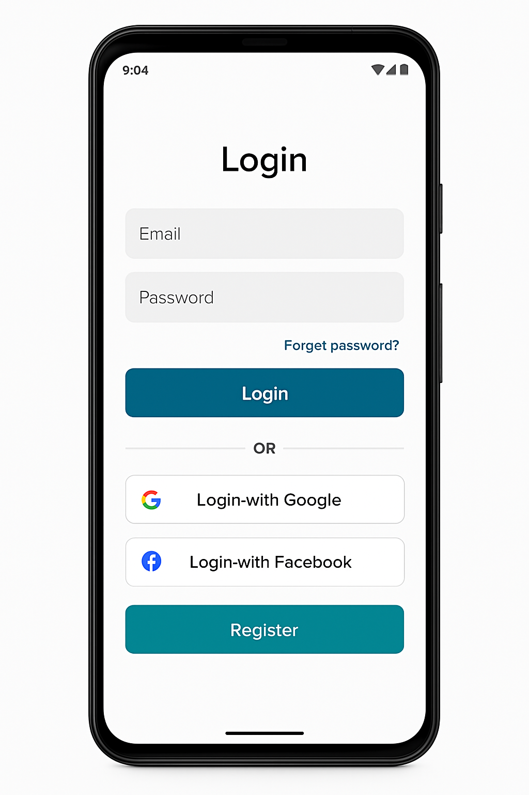
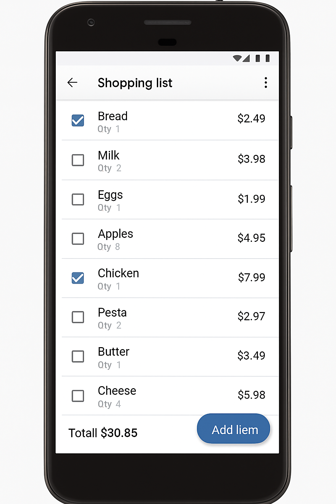
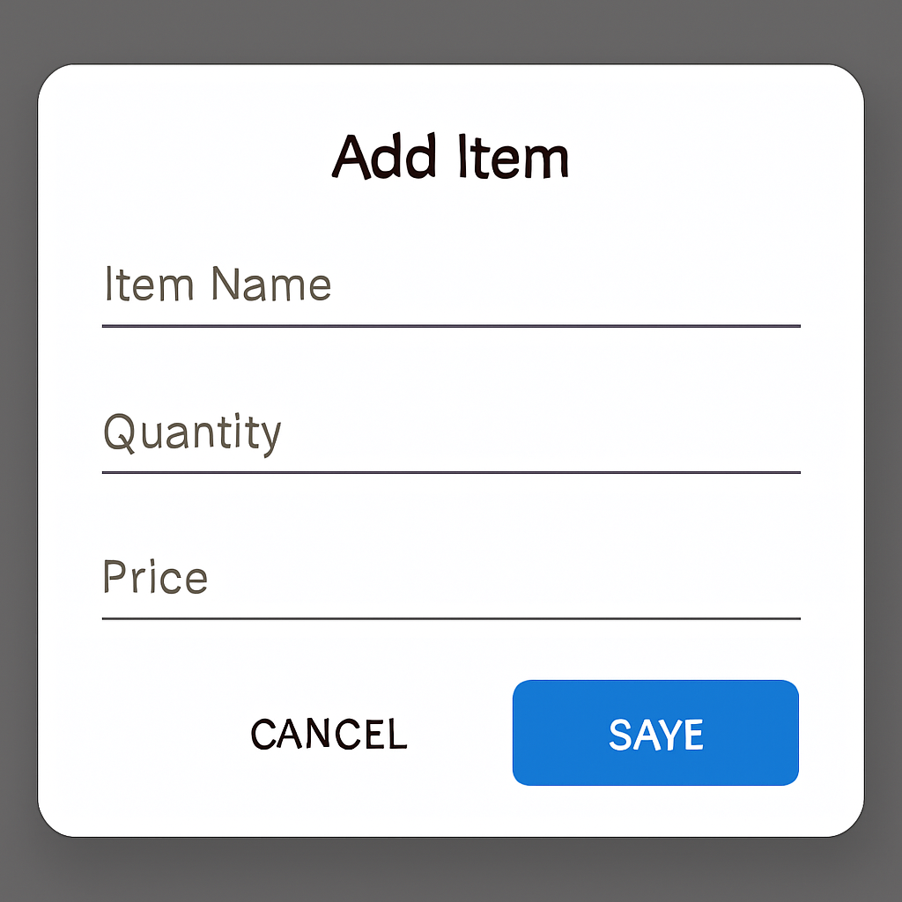
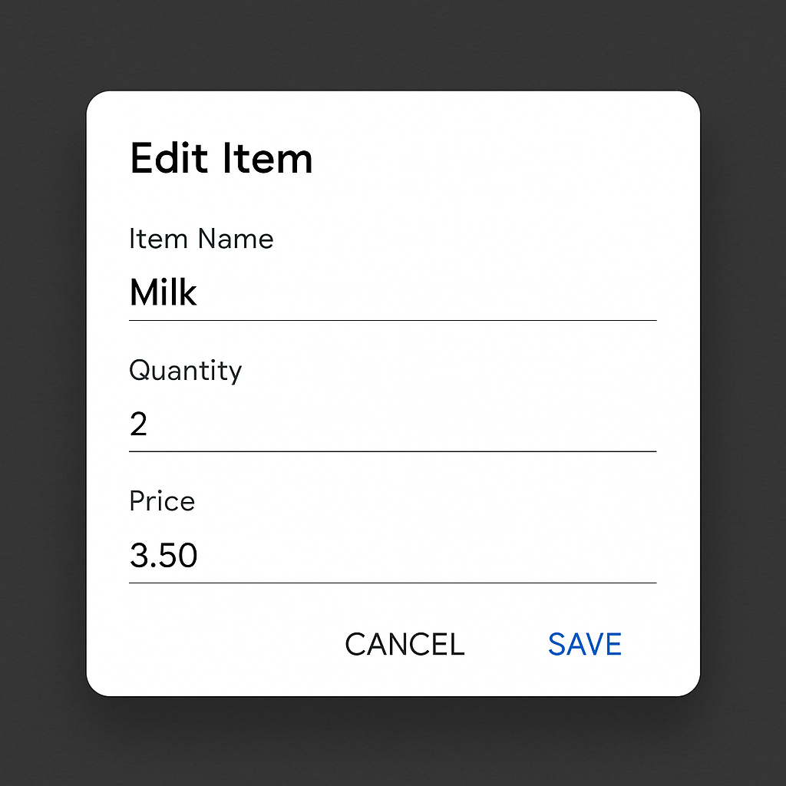
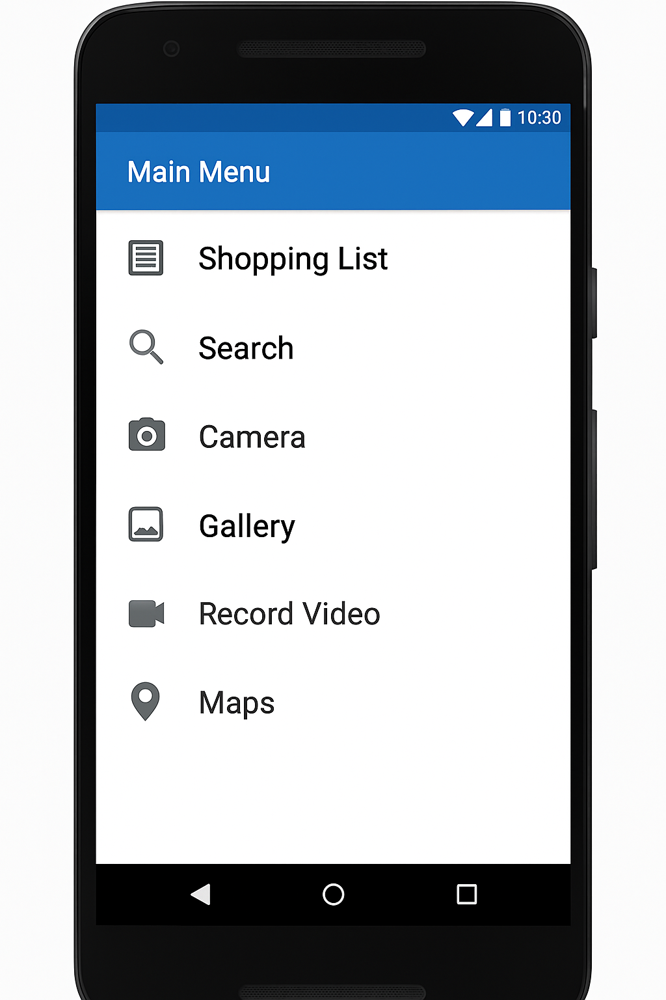
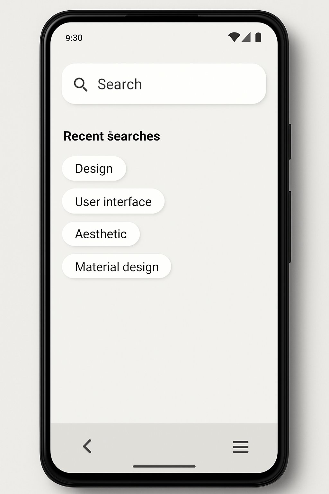
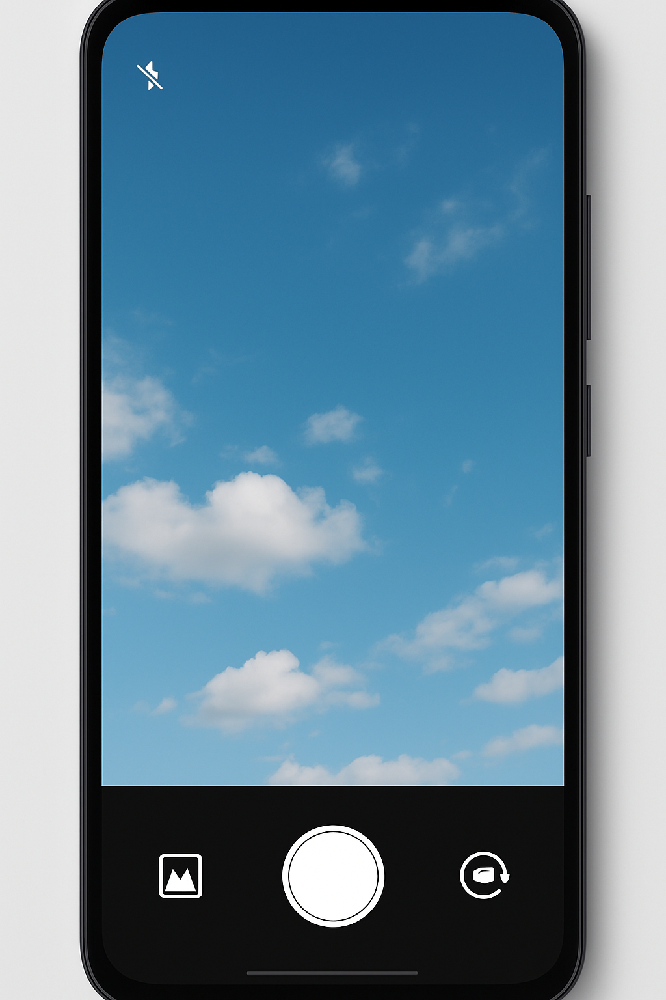
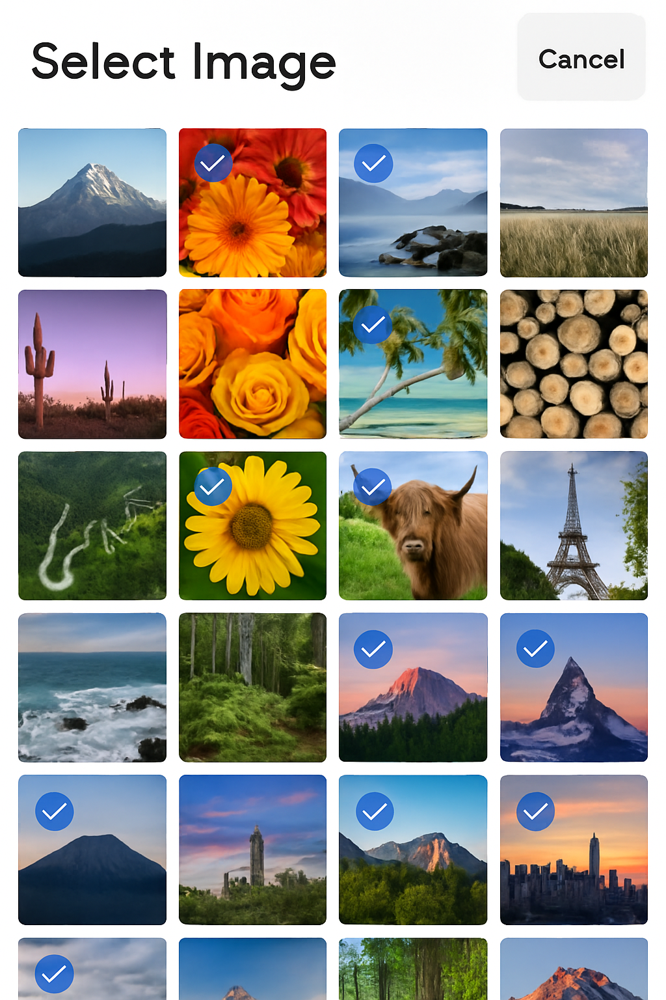
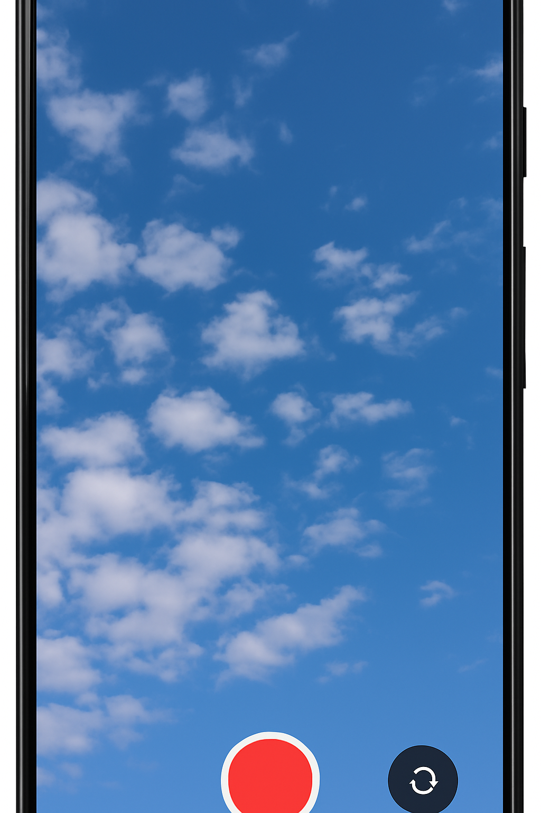
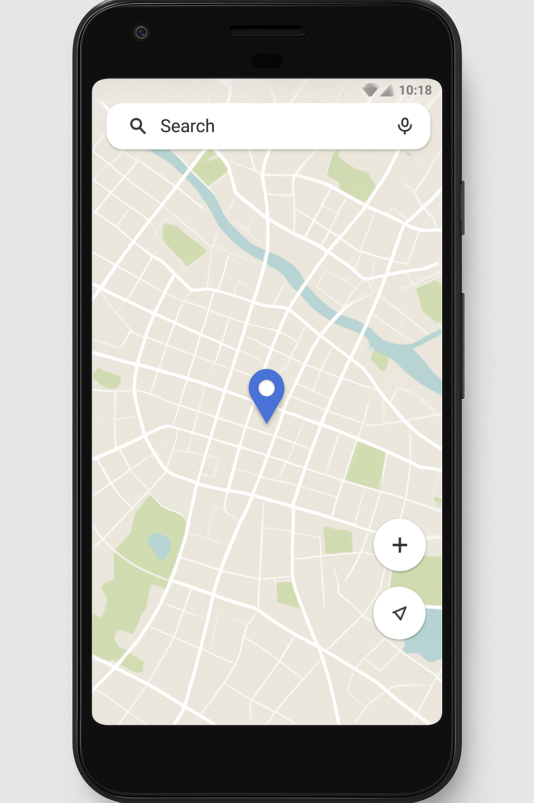
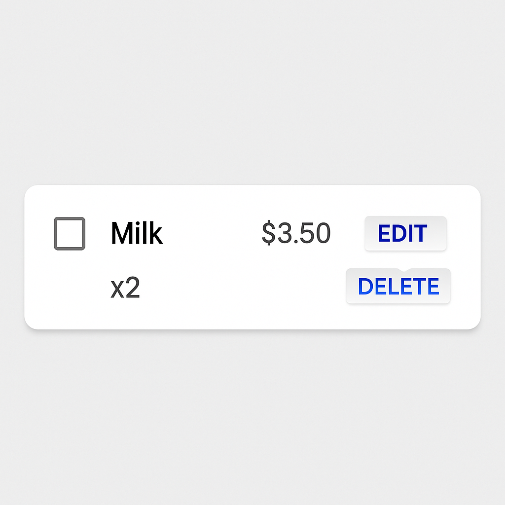